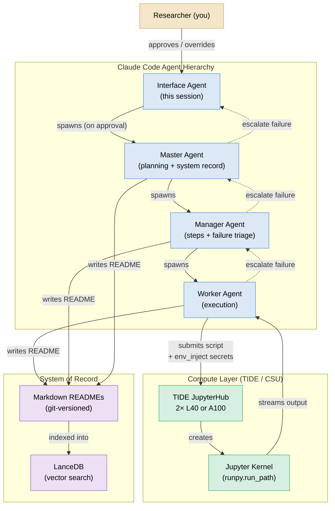

# Iterare — Pitch Outline for Dr. Shokoufeh Mirzaei, CREST-RASM Lab, Cal Poly Pomona

---

## What to Write

### 1. Opening / Framing (1–2 sentences)

- Iterare is an agent-native research infrastructure that lets a single researcher run
  systematic, GPU-scale AI experiments — orchestrated entirely by Claude Code agents,
  with full traceability and human oversight.
- The name means "to iterate" in Latin: the system is built around disciplined,
  evidence-driven iteration rather than ad-hoc scripting.

---

### 2. The Problem It Solves

- Modern ML research requires juggling: compute clusters, experiment tracking, failure
  recovery, documentation, and reproducibility — all while doing the science itself.
- Existing tools (MLflow, W&B, SLURM scripts) are siloed. Agents are increasingly
  capable of doing the coordination work, but no infrastructure exists to harness them
  as first-class research collaborators.
- Iterare treats Claude Code agents as the orchestration layer, not just a code-writing
  assistant: they plan experiments, submit jobs, triage failures, and document findings
  autonomously — with human approval gates for irreversible actions.

---

### 3. Architecture Bullet Points

**Hierarchy (four tiers, all Claude Code agents):**
- Interface Agent — the researcher's direct collaborator; proposes Master spawning
- Master Agent — high-level planning, task decomposition, system-of-record writer
- Manager Agent — concrete steps, Worker spawning, failure triage
- Worker Agent — single-step execution; may run code on remote GPU cluster

**Compute abstraction (TIDE / CSU):**
- Workers submit Python scripts to TIDE (CSU JupyterHub, L40 / A100 GPUs) via a
  Jupyter Server API client
- Scripts run inside Jupyter kernels; output streams live back to the agent
- Secrets injected at runtime via `env_inject`; never written to disk or committed to git

**System of record:**
- Primary: Markdown READMEs in `tasks/<id>/` — human-readable, git-versioned,
  authoritative
- Secondary: LanceDB vector store — re-indexed from markdown, enables semantic search
  across all experiment history
- Every claim carries a confidence marker: [H] peer-reviewed, [M] single credible
  source, [L] inference

**Control flow:**
- Human approval gates for: irreversible actions, external-impact, financial/legal/
  security decisions
- Agents escalate failures up the hierarchy (Worker → Manager → Master → Interface)
- Tool requests: agents formally request new capabilities via YAML; reviewed and
  approved before code is written

---

### 4. Active Research (show it works)

**golf-001 — OpenAI Parameter Golf (complete):**
- Goal: best language model that fits in 16 MB, evaluated on FineWeb-10B
- Result: 1.11316 BPB (sliding-window), beats competition SOTA by −0.0015 BPB
- Key techniques: GPTQ int6 with AR self-generated calibration, GQA + XSA transformer,
  BigramHash vocabulary extension, Parallel Muon optimizer, LZMA compression
- Compute: 2× L40 on TIDE for 3 hours (7,480 training steps)

**steer-001 — Discrete Steering Prefix Research (in progress, MATS-10.0 application):**
- Goal: engineer discrete token prefixes that steer LLM behavior without stating intent
- Core bottleneck identified: soft→discrete gap (soft CE ≈ 0.19; after projection → 1.44)
- SOTA so far: CE = 0.6317 at PREFIX_LEN=32 (Gemma-2-2B-IT, 25 experiments)
- Key finding: Straight-Through estimator is the dominant improvement; scaling is
  super-linear with prefix length (not yet saturated)
- Compute: TIDE 2× A100 80GB, 4h wallclock per submission

---

### 5. Why This Is Relevant to CREST-RASM

*(Fill in based on lab's focus — CREST-RASM works on robotics, autonomy, and
safety-critical systems. Possible angles:)*
- Systematic, reproducible AI research infrastructure aligns with safety-critical
  engineering culture (traceability, evidence quality markers, approval gates)
- Steering prefix research has direct relevance to controllable / steerable AI behavior
  in autonomous systems
- The parameter-efficient model work (golf-001) is relevant to deployment on embedded /
  edge compute in robotic platforms
- The agent orchestration model itself could be adapted for multi-robot task
  decomposition and coordination

---

### 6. What You're Asking For / Offering

*(Customize: collaboration? access to lab's compute? joint publication? RA position?)*
- Possible angles: access to Cal Poly Pomona GPU resources, joint publication on
  steer-001, collaboration on applying the platform to CREST-RASM problem domains

---

## Mermaid Diagram



---

## Directory

```
pitch/crest-rasm-calpolypomona/
├── outline.md          ← this file (bullet points + diagram)
└── iterare-pitch.pdf   ← PDF you will generate from your write-up
```

---

## Suggested PDF Structure

1. Title + your name + date
2. What is Iterare? (1 paragraph)
3. The Problem (3–4 bullets)
4. Architecture (diagram + 4–5 bullets)
5. Research Output: golf-001 (3–4 bullets + key metric)
6. Research Output: steer-001 (3–4 bullets + key metric)
7. Relevance to CREST-RASM (3–4 bullets — customize!)
8. What I'm proposing (1 short paragraph)
